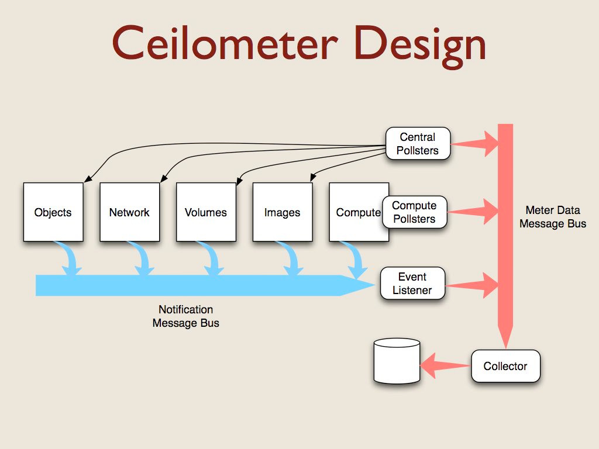
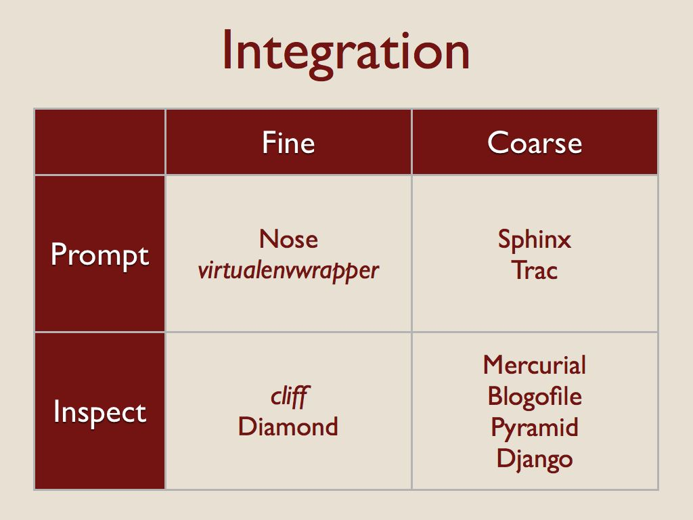
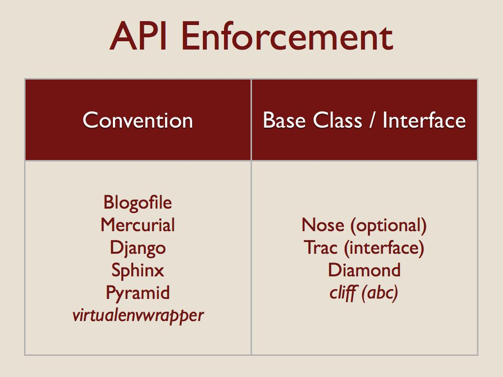
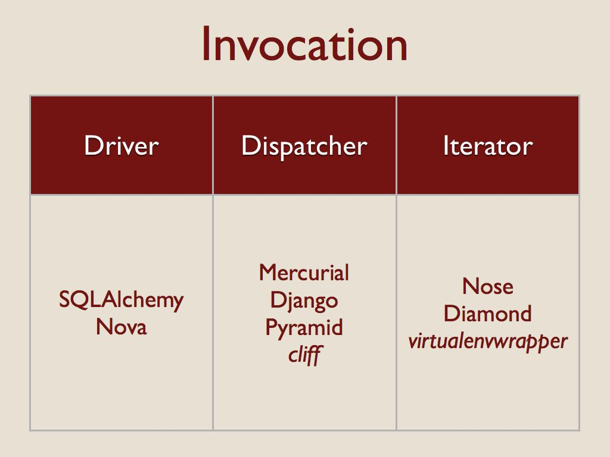

=================================================================
 Dynamic Code Patterns: Extending Your Applications with Plugins
=================================================================

  This essay is based on my PyCon 2013 presentation of the same
  title. The presentation was recorded and the video is `available
  online
  <http://pyvideo.org/video/1789/dynamic-code-patterns-extending-your-application>`__,
  as are `the slides
  <http://www.slideshare.net/doughellmann/dynamic-codepatterns>`__.

Over the past few years I have been doing a lot of work on
applications that make heavy use of Python’s ability to load code
dynamically at runtime. This essay includes the results of some
focused research that I did into patterns for using dynamic code, and
the impact that research had on the design of stevedore and
ceilometer, an application that uses it

For my analysis, I counted any application or framework that loads
code dynamically at runtime to be using plugins. I did not consider
delayed execution of hard-coded import statements as plugins, but
restricted the research to true dynamic loading. In most cases, the
name or location of the code is given through some external mechanism
like a configuration file.

Why Use Plugins?
================

Before examining patterns for using plugins, we should talk about why
to use plugins in an application at all.

One important benefit is improved design. Keeping a separation between
core and extension code encourages you to think more about
abstractions in your design. Building an extensible system can take
more work than hardwiring everything, but the results tend to be more
flexible and maintainable over the long term.

Plugins are a good way to implement device drivers and other versions
of the `Strategy pattern`_. The application can maintain generic core
logic, and the plugin can handle the details for interfacing with an
outside system or device.

.. _Strategy pattern: http://en.wikipedia.org/wiki/Strategy_pattern

Packaging extensions separately reduces dependency bloat and makes
deployment easier to manage and install. Users who do not need some
drivers or features can avoid deploying dependencies that are only
used by those plugins.

Plugins also provide a convenient way to extend the feature set of an
application by hooking new code into well-defined extension points.
And having such an extensible system makes it easier for other
developers to contribute to your project indirectly by providing
add-on packages that are released separately.

Requirements for Ceilometer
===========================

I have spent a fair bit of time studying plugin-based architectures
over the last year while helping to create ceilometer_, the new
metering component in OpenStack_. Ceilometer measures the resources
being used in a cloud deployment so we can bill the tenants for those
resources. We collect data like the lifetimes of servers, along with
bandwidth and storage consumed.

.. _OpenStack: http://openstack.org
.. _ceilometer: https://launchpad.net/ceilometer

However, the type and number of things a given cloud deployer will
want to charge for will vary, so we wanted a flexible system for
taking those measurements. We need to allow deployers to write their
own plugins to measure things we haven’t thought of, or that may need
to be measured in a way that is private to their configuration (a case
we have at DreamHost).

We are expecting a lot of developers who don’t interact with us
directly to be trying to write extensions to ceilometer for use in
private cloud deployments, so it is also important to clearly document
how to create new plugins.

With these things in mind, we designed ceilometer to be flexible in
several different areas.

OpenStack is a collection of components that cooperate to provide
`Infrastructure as a Service`_ features.  Each component manages a
different aspect of the cloud and uses a message bus to communicate
with the other components.  

All of the components generate notification messages when events
happen (like instances being created or destroyed). Capturing those
messages was the first source of data for ceilometer.  The
notifications contain different metadata depending on the resource
that triggered the event, so we needed plugins to translate the
notification messages into a standard format for metering.

.. _Infrastructure as a Service: http://en.wikipedia.org/wiki/Cloud_computing

There aren’t events for all of the things we want to measure for
billing, so we also had to create some agents to poll for data.  For
example, we want to check periodically to see how much CPU capacity
each instance has consumed. Some pollsters run on the hypervisor
server, and others run on a management server where they can
communicate with the other OpenStack components via their APIs.

All of the ceilometer services use another message bus to deliver data
to a collector process which uses a storage driver to write data to a
database. We support relational and non-relational databases,
depending on the choice of the deployer.

This architecture resulted in five sets of plugins for ceilometer.
OpenStack includes a message bus abstraction layer and a set of
drivers for using RabbitMQ, Qpid, and ZMQ. Since that was already
implemented for us, we didn’t have to touch it.

The other 4 sets we created from scratch:

* The plugins for processing notification messages
* The pollsters for the compute nodes
* The central pollsters
* And the storage driver

The resulting designs use patterns found in other applications and
frameworks that use plugins.

Other Plugin-based Applications
===============================

During my research, I looked at a few projects that I was already
familiar with, either as a user or a developer, and some I had not
used before. There are plenty of other examples, but this list was
long enough to identify some common patterns and help us with our
design.

Blogofile_ and Sphinx_ are two apps for working with different forms
of text for publishing. They use extensions to add new content
processing features.

.. _Blogofile: http://blogofile.com/
.. _Sphinx: http://sphinx-doc.org/

Mercurial_ is a command line app that can be extended with new
subcommands. Cliff_ is a library I created for building apps like
Mercurial.

.. _Mercurial: http://mercurial.selenic.com/
.. _Cliff: http://cliff.readthedocs.org

Virtualenvwrapper_ is a command line tool that uses hooks in a
different way, to extend existing commands but not necessarily add new
ones.

.. _Virtualenvwrapper: http://virtualenvwrapper.readthedocs.org

Nose_ and Trac_ are common developer tools. You’re more likely to have
used them than written extensions for them, but they do both use
plugins.

.. _Nose: https://nose.readthedocs.org/
.. _Trac: http://trac.edgewall.org/

Django_, Pyramid_, and SQLAlchemy_ are developer libraries that use
plugins.

.. _Django: https://www.djangoproject.com
.. _Pyramid: http://docs.pylonsproject.org/projects/pyramid/en/latest/
.. _SQLAlchemy: http://www.sqlalchemy.org

Diamond_ is a monitoring app with an extensive plugin set, similar to
the system we were planning to build for OpenStack.

.. _Diamond: https://github.com/BrightcoveOS/Diamond

Nova_ is the primary component of the OpenStack cloud system. It relies
on a large number of drivers for managing different aspects of the
computing environment.

.. _Nova: https://launchpad.net/nova

I looked at all of this code in an effort to derive ideas about the
"right way" to handle plugins for ceilometer. While some of what I
will say today may sound critical of the choices made by the
developers of the other code, I do have the benefit of hindsight and a
different perspective based on looking at the examples all together,
as well as different requirements for our project.

Discovery
=========

The first thing an application has to do with a plugin is find it.
The tools I looked at are split between some form of explicit
definition of plugins and a scanner that looked for the plugins.

.. image:: discovery.jpg
   :scale: 50
   :align: center

Each of those sets is then further divided between what was being
listed or scanned -- files on the filesystem, or python import
references (either a module, or something inside of a module).

The "Explicit import reference" category means there is a
configuration file somewhere and a user lists an importable object in
that file.

The "Scan import reference" category means a registry of import
strings is being scanned. All of these examples use setuptools and
pkg_resources to manage entry points.

Enabling
========

After the app finds a plugin, the next step is to decide whether to
load it and use it. Most applications require an explicit step to
configure extensions.  There are times when this makes
sense. Developer tools like Django are right to ask the developer to
list the desired extensions explicitly, since you’re really bringing
that code in statically.  The extensions to SQLAlchemy are all
enabled, but only one is really used at a time and that is chosen by
the database connection string.

.. image:: enabling.jpg
   :scale: 50
   :align: center

However, some of the user applications like Blogofile, Mercurial, and
Trac ask the user to explicitly enable extensions through a
configuration step that seems like it could be skipped.  When I
created virtualenvwrapper and cliff, I decided to use installation as
a trigger for activation because I wanted to avoid an extra
opportunity for misconfiguration. In both of those cases, installing
an extension makes it available, so the user can start taking
advantage of it immediately.

That’s also true for Nose extensions, although whether or not they are
used for a given test suite or test run depends on the options you
give nose.

Importing
=========

After the app decides whether to load a plugin, the next step is to
actually get the code.  All of the examples I looked at used two
techniques, either calling import explicitly (by using the builtin
function, the imp module, or some other variation), or using
pkg_resources.

.. image:: importing.jpg
   :scale: 50
   :align: center

Nose, SQLAlchemy, and Blogofile all use both techniques.  Nose falls
back to a custom importer if pkg_resources is not installed.
SQLAlchemy uses a custom importer for "extensions" distributed with
the core but pkg_resources to find separate packages.  Blogofile uses
pkg_resources to find plugins, coupled with manual scanning and
importing of the directories containing those plugins to load their
parts.

If I discount the packages I created myself, shown here in italics,
there seems to be a clear bias towards creating custom wrappers around
import.  That route seems easy at first, but all of the
implementations I found exhibited some problems with tricky corner
cases.

Application/Plugin Integration
==============================

After the code for the extension is imported, the next step is to
integrate it with the rest of the app.  That is, to configure any
hooks that need to call into the plugin, pass the plugin any state it
needs, etc.  I looked at this step along two axes.

First, I considered the granularity of the plugin interface. For
"fine" grained plugins, the extension is treated as a standalone
object to be called on as needed. In these cases, the code object
being loaded is usually a function or a class.

For more "coarse" grained cases, a single plugin will include hooks
that are referenced from multiple places in the application. There may
be several classes inside the plugin, for example, or templates that
are accessed directly by the application, not through a plugin API.

The other axis related to integration looks at how the code provided
by the plugin is brought into the application. I found two techniques
for doing that.

First, the application can instruct the plugin to integrate
itself. That prompting usually takes the form of a setup() or
initialization function implemented by the plugin author that calls
back to an application context object, registering parts of the plugin
explicitly. That registration could also be handled implicitly using
an interface library such as the way Trac uses zope.interface.

Second, the application itself can interrogate or inspect the plugin,
and make decisions based on the result. This usually means that part
of the plugin API is responsible for providing metadata about the
plugin itself, not just taking action.

API Enforcement
===============

One common issue with dynamically loaded code is enforcing the plugin
API at runtime.  This is always a potential issue in dynamic
languages, but it comes up frequently with plugins because the code is
often written by someone other than the core developer for the
application.  I saw two basic techniques to help developers get their
plugins right: convention and interfaces.

Many of the applications that used convention also had coarse-grained
plugin APIs, and so while they may use classes to provide their
features, the plugin relies on convention for discovering its
configuration.

On the right are applications for which the plugin uses a class
hierarchy. In the case of Nose, using the base class is optional, so
that’s a quasi-interface. Trac, on the other hand, uses formal
interfaces through `zope.interface`_.

.. _zope.interface: http://docs.zope.org/zope.interface

Diamond enforces a strict subclassing of its Collector base class.

For cliff I chose to use the abc_ module to define an abstract base
class, but stick with `"duck typing"`_ in the actual application. The
developer doesn’t have to inherit from the base class, but doing so
helps ensure that the implementation is complete.

.. _abc: http://docs.python.org/2/library/abc.html
.. _"duck typing": http://en.wikipedia.org/wiki/Duck_typing

Invocation
==========

And the final dimension I looked at was how the plugin code was used
at runtime.  There were three primary patterns here.

1. "Drivers" are loaded one at a time, and used directly.

2. The apps using the "Dispatcher" pattern load all of the extensions,
   and then make calls to the appropriate one based on name or some
   other selection criteria when an event happens.

3. The apps that use the "Iterator" pattern call each extension in turn,
   so that all of the plugins have a chance to participate in the
   processing.

Ceilometer Design
=================

This analysis had a direct influence on the choices we made while
implementing ceilometer.

Discovery and Import
--------------------

For finding and loading, we chose to use entry points because they
were the simplest solution.  All of the apps that work on files
instead of import references had issues, ranging from poorly
implemented import path munging to packaging and distribution
challenges. Even some of the code for working with import references
directly was a little hairy. Leaving that to a library that handles
the different cases transparently made our life a lot easier.

They are easier for users to install and configure because they don’t
have to understand how your code is laid out. That also makes them
more resilient in the face of code changes.

Entry points also support different package formats (egg, sdist,
operating system packages), so it doesn’t matter how extensions are
distributed.

They also make it easier for code to be packaged by the Linux
distributions, since the packages don’t have to share overlapping
installation directories.

There are alternate implementations of entry-point like systems, but
none are so widely used or tested as pkg_resources.

And to further simplify, we always use entry points, even for the
plugins we distribute with our core. That eliminates any special
cases.

Enabling
--------

We came up with a somewhat novel solution to manage which plugins are
enabled.  For Ceilometer we wanted to default to collecting data, but
allow deployers to disable certain meters to save storage space if
they knew they did not need the data. The solution was to use explicit
configuration, but invert it from the normal implementation.

We assume that all of the extensions found should be loaded and used,
unless they are explicitly *disabled* in the configuration file. We did
that in the first version to simplify the configuration process,
because we assumed most users would want most of the plugins to be
used. Defaulting to enabled means users only have to provide a short
list of the meters to turn off.

Ceilometer plugins also have a chance, when they are being loaded, to
disable themselves automatically. This is especially useful in the
polling plugins, which can tell the app to ignore them if the resource
they use for collecting measurements is not present (like they work
with a different hypervisor, or external service that is not
configured).

Letting the plugin disable itself avoids repeated warning messages in
the log file as a plugin is asked to poll for data that it cannot
retrieve.

Integration
-----------

For our integration pattern we went with a fine-grained API using
inspection.  There is a separate namespace for each type of plugin,
and each plugin instance refers to a single class.  The application
loads and instantiates that class, then calls methods on it it to
determine what it provides and wants (which notifications to subscribe
to and which meters are produced).

This design lets us avoid having repetitious setup or configuration
code in each plugin, since they provide data to the application on
demand and the application configures itself.  The instances don’t
know about the application, or each other.  They only run when the
application calls them, never independently.

API Enforcement
---------------

To define the API for each set of plugins we created a separate
abstract base class using the abc module.  This gives us a way to
document each plugin API and Developers who use the base class get
some help for free.

Since we don’t enforce the class hierarchy we also watch for
unexpected errors from the plugins any time we call into them.

Invocation
----------

We used all three invocation patterns, in different places.  

1. We only use one storage system at a time, so we treat the storage
   plugin like a driver.

2. We load all of the notification plugins, and then dispatch incoming
   messages to them based on the message content.

3. We load all of the polling plugins and iterate through them on a
   regular schedule.

Conclusions
===========

After we had all of this working in ceilometer, I extracted some of
the code into stevedore.  It wraps pkg_resources with a series of
manager classes that implement the loading, enabling, and invocation
patterns.

.. seealso::

  * PyCon 2013 Video: http://pyvideo.org/video/1789/dynamic-code-patterns-extending-your-application
  * Slides: http://www.slideshare.net/doughellmann/dynamic-codepatterns
  * :doc:`/patterns_loading`
  * :doc:`/patterns_enabling`
